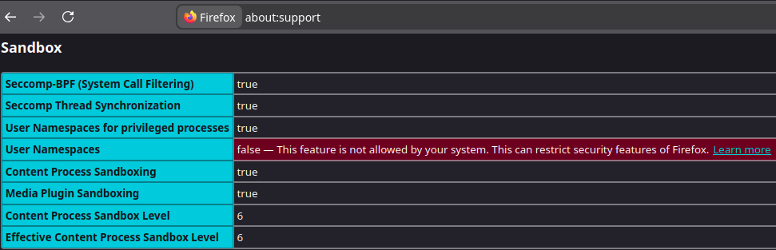
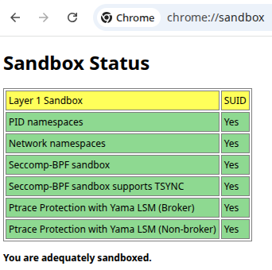
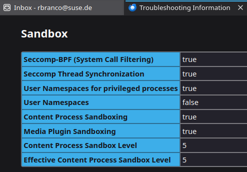

### Why does rootless Podman still work after loading userns_restrict?

Rootless Podman uses `catatonit -P` as a pause process to hold the user
namespace open. If the BPF program is loaded after Podman is already running,
the existing user namespace is unaffected. `userns_create` only fires on
creation, not on existing namespaces.

Killing the catatonit process tears down the user namespace. When Podman tries
to recreate it, `CLONE_NEWUSER` is blocked by the LSM and it gets `EPERM`.

See https://github.com/podman-container-tools/podman/issues/26578#issuecomment-3044062352

---

### Does userns_restrict break browser sandboxing (Firefox, Chromium, Thunderbird)?

Mostly Firefox and maybe Thunderbird.  Both Chrome & Firefox use unprivileged user
namespaces if available, but only Chrome falls back to a setuid-root helper
(`chrome-sandbox`) that creates namespaces on the browser's behalf.  Stock
Chrome & Vivaldi ship it:

```
$ find /opt -name \*sandbox -perm /06000
/opt/google/chrome/chrome-sandbox
/opt/vivaldi/vivaldi-sandbox
```

Thunderbird shares Firefox's Gecko/toolkit sandbox code and has no
equivalent fallback, so it degrades the same way.

Check the application's own diagnostics after loading this program rather
than assuming graceful degradation. Firefox's `about:support` and
Thunderbird's *Help → Troubleshooting Information* show the active
sandbox level; Chromium's `chrome://sandbox` shows per-layer sandbox status.







More information in:
- https://wiki.mozilla.org/Security/Sandbox
- https://chromium.googlesource.com/chromium/src.git/+/refs/heads/main/sandbox/linux
- https://gitlab.tails.boum.org/tails/tails/-/issues/21334 (Thunderbird sandbox degraded the same way)

---

### Does userns_restrict break Flatpak apps?

Maybe.  See https://github.com/flatpak/flatpak/wiki/User-namespace-requirements

---

### Can I build these on one machine and run them on another architecture?

Yes. Use `make` for little-endian machines (x86_64, aarch64, ...) or
`make BPFTARGET=bpfeb` for big-endian (s390x, ...), then copy the resulting
`.o` file over.  No cross-compiler needed.

The build doesn't need to match the target's kernel version either, just its byte order.
